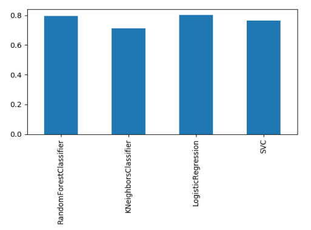

Для решения данной задачи воспользуемся библиотеками `pandas` для обработки данных и `sklearn` для создания классификатора.

Первоначально нам необходимо подготовить входные данные для обучения классификатора.

Так как библиотека `sklearn` принимает на вход только числовые значения, а в нашей таблице содержатся поля со строковыми( `Rating`, `Language`, `Country`) – заменим их соответствующими числовыми лейблами. Также нам необходимо удостовериться, что в полях нет пустых значений. Так для столбца `Rating` мы заменим все `NaN` значения на `Not Rated`, для `Language` - на `English`, как самый частоупотребимый.
Далее нам необходимо избавиться от неиспользуемых столбцов в таблице. Для обучающей выборки этими столбцами станут `Id`, `Poster`.

Для проверки точности наших моделей используем `кросс-валидацию` и `ROC-кривые`. Для обучения классификатора попробуем использовать метод опорных векторов, метод ближайших соседей, Random forest и логистическую регрессию.
Нам следует отделить `Target` показатель нашей выборки от признаков, которые его определяют.

Далее выполним кросс-валидацию обучающей выборки:

Из графика можем сделать вывод, что максимальную эффективность показали алгоритмы `Random Forest` и `логистическая регрессия`.

Далее взглянем на график ROC-кривых:

Из графика видно, что лучший результат показал алгоритм логистический регрессии.
Теперь применим его к тестовой выборке и запишем в CSV результат.

Также можно было попытаться найти корреляции между цветовой гаммой постеров и принадлежностью к целевому классу.
